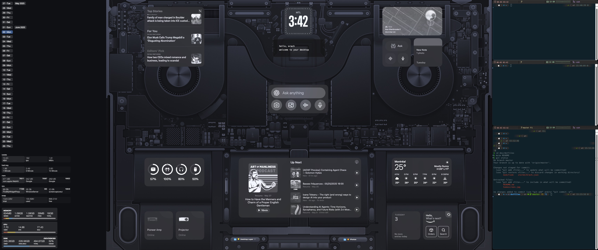

# 🖥️ My Dotfiles

Welcome to my dotfiles repository! This is where I keep all my system configuration files, ensuring a consistent and personalized development environment across all my machines.


## 📁 Included Configurations

- **Shell**: `.zshrc` (Zsh configuration with Oh My Zsh and Powerlevel10k)
- **Terminal**: iTerm2 configuration and color schemes
- **Editor**: `.vimrc` (Vim configuration)
- **Window Management**: Magnet
- **Claude AI**: `dotclaude/` (Templates and configuration for Claude development assistant)

## 🚀 Installation

1. Clone this repository to your home directory:
   ```bash
   git clone https://github.com/arach/dotfiles.git ~/dotfiles
   ```

2. Run the setup script (if available):
   ```bash
   cd ~/dotfiles
   ./install.sh
   ```

3. Or manually create symlinks to the configuration files:
   ```bash
   ln -s ~/dotfiles/.zshrc ~/.zshrc
   ln -s ~/dotfiles/.vimrc ~/.vimrc
   # Add other config files as needed
   ```

## ✨ Features

- **Zsh with Powerlevel10k**: A fast and customizable Zsh prompt
- **iTerm2 Integration**: Custom color schemes and profiles
- **Vim Configuration**: Optimized for development with plugins and keybindings
- **Window Management**: Custom window layouts with Slate

## 🛠️ Dependencies

- [Oh My Zsh](https://ohmyz.sh/)
- [Powerlevel10k](https://github.com/romkatv/powerlevel10k)
- [iTerm2](https://iterm2.com/)

## 🤖 Claude Development Assistant

The `dotclaude/` directory contains templates and configuration for setting up Claude AI as your development assistant:

- **`CLAUDE_TEMPLATE.md`**: Comprehensive template for project-specific Claude instructions including:
  - Git commit style guidelines (using gitmoji)
  - Code style preferences (TypeScript, React best practices)
  - Development workflow and quality standards
  - Architecture patterns and debugging commands

- **`setup-project.sh`**: Quick setup script to initialize Claude in new projects
  ```bash
  cd ~/dotfiles/dotclaude
  ./setup-project.sh /path/to/your/project
  ```

- **`preferences.md`**: Personal preferences for Claude's behavior
- **`settings.json`**: Claude Code configuration (theme, permissions, etc.)
- **`claude_project.json`**: Default project settings template

### Quick Setup for New Projects

To add Claude development guidelines to a new project:
```bash
~/dotfiles/dotclaude/setup-project.sh
```

This will create a `CLAUDE.md` file in your project with development guidelines and set up gitmoji commit templates.

## 📚 Other Configurations
- [Übersicht](https://github.com/felixhageloh/uebersicht) - helps me add custom widgets on homscreen
- [macOS Widgets](https://support.apple.com/en-ca/guide/mac-help/mchl52be5da5/mac) - new in macOS 15
- [Monochrome](monochrome.png)

## Preview




## 🤝 Contributing

Feel free to fork this repository and customize it for your own use. If you find any issues or have suggestions for improvements, please open an issue or submit a pull request.

## 📄 License

This project is licensed under the MIT License - see the [LICENSE](LICENSE) file for details.

---

*Last updated: June 2025*
